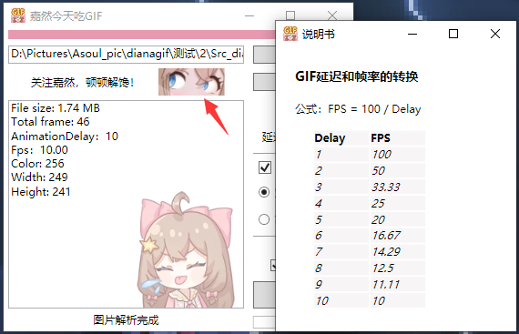

# DianaGIF

Github下载：https://github.com/SpecialSmiler/DianaGif/releases/

Gitee下载：https://gitee.com/special-smiler/diana-gif/releases/

## **功能：**

1. 对于帧率较高的GIF图，修改其Delay值，并抽帧，保证整体播放速度不变
2. 等比例缩放GIF图片尺寸（仅支持等比例，不支持变形拉伸）

#### 注意:

本程序只提供`Delay`在范围`(2,10)`之间的转换，只允许从低Delay转换到高Delay（即只允许降帧）。因为本程序的宗旨是为帧数过高的GIF降帧。对于`Delay>=10`的的GIF，不提供继续增大`Delay`的功能，但依然可以使用修改图片尺寸的功能。

  

## 使用的第三方库

- [Magick.NET.SystemDrawing (4.0.5)](https://github.com/dlemstra/Magick.NET)
- [Magick.NET-Q8-AnyCPU (8.3.0)](https://github.com/dlemstra/Magick.NET)

## 界面外观

点击Diana明亮的大眼睛可以打开说明书，查看Delay和FPS之间的转换表。

## 关于GIF的播放速度

GIF的播放速度，取决于每一帧的`delay`值。delay值越小，播放速度越快。

[Frame Delay Times for Animated GIFs](https://www.deviantart.com/humpy77/journal/Frame-Delay-Times-for-Animated-GIFs-240992090)

> Process each graphic in the Data Stream in sequence, without delays other than those specified in the control information.

> Delay Time - If not 0, this field specifies the number of hundredths (1/100) of a second to wait before continuing with the processing of the Data Stream. The clock starts ticking immediately after the graphic is rendered.

`delay`的单位为“百分之一秒”。`delay=1`表示播放完这一帧需要等待一个“百分之一秒，也就是10ms（0.01s）。

`Delay = 0`，则渲染完一帧就马上播放下一帧（当然这是不实际的）
`Delay = 1`，则0.01秒播放一帧，即100fps；
`Delay = 2`，则0.02秒播放一帧，即50fps；
`Delay = 3`，则0.03秒播放一帧，即33.3fps；
`Delay = 10`，则0.1秒播放一帧，即10fps；
……

Delay = 0是不实际的，如果cpu处理太快的话，gif图一瞬间就播放完了，完全没有动画的效果。

但是，通常我们的窗口并不会刷新这么快，所以即便 `delay=0` ，实际的播放速度看上去也不会很快。

- 对于一些播放器，当delay值过小的时候，会自动调整成固定值。比如某个播放器能接受的最小delay为3，那么当它播放delay=0,1,2的gif时，就会强制以delay=3的速度播放。
- 某些聊天软件的gif播放器就比较拉胯，无视图片本身携带的delay值，直接将播放速度固定成delay=6，对于delay=2的图，它以delay=6的速度播放，造成图片播放变慢；对于delay=10的图片，它也以delay=6的速度播放，造成图片播放速度变快。

## 关于FpsConverter

有时候我们对视频的帧率不满意，会对其进行调整。当我们从低帧率转换到高帧率的时候，会进行“插帧“，但一般来讲并不会使得视频变得流畅，因为新增的帧只是从原来的帧复制过来的，并没有产生一个好的过渡。如果想要让帧率变高且视频便流畅，就需要用到补帧技术。

这里不探讨补帧，不探讨帧率由低变高的情况，我们在这里只探讨帧率由高变低。

帧率有高变低，需要删除一些帧，即”抽帧“，让我们的总帧数下降。

当我们想让帧率下降一半的的时候（比如：60fps -> 30fps)，设步长为step，则此时`step=2`，在遍历帧序列的时候，每隔一帧，挑一张出来作为保留。如下图红色部分，就是要保留的帧。

又比如，当我们帧率要降低为原来的1/3的时候，我们就要在每3帧中拿出1帧作保留，此时step=3

但并不是所有的变换都这么简单。在上面的两个例子中，我们在一开始就设定好了step，在整个遍历过程中都不需要改变，但是有些情况下，step需要动态地变化。

比如（7fps -> 4fps），即在7帧中抽出4帧作为保留

可以看到，我们的step再某处经历了从1到2的变化。可以把step的变化看做一个数组`steps=[1,2,2,2]`，至于为什么是这样，有什么特别的吗，是怎么得到的？emmm……，其实这只是我自己人为划分出来的而已，我认为按照`steps=[1,2,2,2]`这样的划分，可以在7帧中，比较均匀地抽4帧出来。

当然还可以有其他的分法，比如：

以上两种方法中，steps分别为`[2,2,2,1]`和`[2,1,2,2]`。

但为什么我最终选择了`[1,2,2,2]`呢？

我这里遵循了这么一个原则：

- 越靠近开头的帧，越要保留，就比如我开始step设置成了1，从而使得下标为0和下标为1的帧都保留了。

如果一开始就将step设置为2，那么相对来讲，靠近前面的帧就被跳过了。违背了上述原则。

为什么我要尽量地保留开头的帧呢？因为我在这里认为“越靠近开头的帧，**越重要**”，所以换句话来说，“越重要的帧，我越要保留”。但是对于你来讲，可能不这么认为，你可能觉得“越靠近尾部的帧越重要”那么你可以选择使用`steps=[2,2,2,1]`这个序列，如果你想的话，甚至下标为0的这个帧也可以舍去。

### 抽帧算法

想从高帧率转换成低帧率，我们的做法就是抽帧。遍历整个帧序列，将需要保留的帧提取出来，再形成一个新的帧序列，这个新的帧序列便是降帧之后的序列。

在遍历帧序列的过程中，我们需要知道步长step是多少。当我们变换是整数倍的时候，step全程都可以不变，比如将帧率变为原来的一半，那么step=2；再比如将帧率变为原来的1/3，那么step=3。但有时候，我们可能会有一些特殊需求，希望将帧率变为原来的2/3、4/7、5/8等等。这时候，我们的step在遍历过程中就需要动态地变化。

那么，我们现在的主要问题就是希望有个算法，可以”获得一个steps数组“，这个steps数组便是step在遍历过程中需要动态变化的值。再看看两个比较复杂一点的例子：

- 将帧率从8变为3

- 将帧率从10变为7

| InputFps | OutputFps | Steps           |
| -------- | --------- | --------------- |
| 8        | 3         | [2,3,3]         |
| 10       | 7         | [1,1,2,1,2,1,2] |

可以发现一个规律

- steps数组的长度，刚好等于OutputFps，而steps数组所有元素的总和等于InputFps

> 此时你可能想到，如果我从20帧变到14帧，那么和10帧变到7帧，使用的应该是同一个steps数组。是的，确实是这样，所以在进行steps数组的生成之前，我们需要对InputFps，OutputFps进行约分。具体做法就是求出它们的最大公因子，然后分别除它们就可以了。至于怎么求最大公因子，可以使用辗转相除法。

> 上面的两个steps数组都是我自己手写出来的，是我自己通过肉眼判断，依靠一些比较“主观”的规律，写出来的。但是计算机并没有”我“这么主观，我必须得找出一些”客观“的规律，写成一个算法，才能让计算机知道该怎么做。

看看10->7的steps数组`res = [1,1,2,1,2,1,2]`，其长度为7，元素总和为10。假设现在也有个长度为7的数组`pre = [1,1,1,1,1,1,1]`，此时元素总和为7，和res相比少了3，即`remain = InputFps MOD OutputFps`。那么，想要将pre变成res，将remain拆成许多个1，然后均匀地分发在pre中。即在pre合适的位置+1，一共加remain次，最终便得到res。

那么“合适的位置”该怎么找呢？我发现可以将pre分成3个子数组，

对于每个子数组，我们优先在尾部进行“+1”操作。对于所有子数组，我们优先对最后一个子数组先做操作。我们首先对pre[2]进行操作，在它尾部进行+1。接着对pre[1]进行操作，在它尾部+1，最后再找到pre[0]，在它尾部+1。

但假设我们不是10->7，而是11->7，那么我们就有4个“1”等着我们去分配。这样，在分配完3个1之后，我们要回到pre[2]，但这次不是在尾部了，而是在尾部的倒数第二个元素的位置+1。

#### 总结上面：

1. 首先必须要将`InputFps`和`OutputFps`进行约分；
2. 初始化一个长度为`OutputFps`的数组pre；
3. pre初始化时，每个元素的初始值为`InputFps 整除 OutputFps `
4. 为了均匀地分配“1”，我们需要将pre分成`Parts` 份，
    `Parts = (InputFps - OutputFps) MOD OutputFps`；
5. 从pre到res，我们需要均匀地分配`remain = InputFps MOD OutputFps`个“1”;

**但是还有一个问题：**

- 为什么pre划分成的3个数组中，pre[0]的长度为3，而pre[1]和pre[2]的长度为2。

在生成pre的子数组之前，我们还需要一个数组`subArrLen`来表示每个子数组的长度，然后根据这个来生成我们确切的pre[0]、pre[1]等等。正如上面的10->7例子中，`subArrLen=[3,2,2]`，发现该数组的长度为`Parts`，元素的总和为`OutputFps`。

subArrlen的生成方法和res的生成方法类似。设`subArrLen`的每个元素初始值为x，`x = OutputFps / Parts `（整除，向下取整），则一开始`subArrLen=[2,2,2]`，此时有`remain = OutputFps % Parts` ，将remain从subArrlen的头部开始分发，最终得到`[3,2,2]`

### 算法步骤总结

1. 将`InputFps`和`OutputFps`约分（必须）；
2. 生成`subArrlen`
3. 根据`subArrlen`初始化`pre[0]`、`pre[1]`、`pre[2]`……
4. 计算`remain`
5. 将`remain`均匀地分法到这些`pre[i]`中
6. 合并所有`pre[i]`，形成一个`res`，`res`便是最终的`steps`数组。

在遍历帧序列的时候，根据这个steps数组去改变步长，从而“均匀”地抽帧。

### 图片展示

10->7

11->7

12->7

